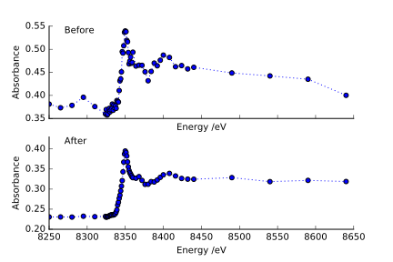

******************
Analyzing the Data
******************

After importing the data, you will likely need to process and analyze
the frame set. This is done through the
:py:class:`xanespy.xanes_frameset.XanesFrameset` class. Most
**processing and analysis steps are provided as methods on this
class**, so the first step is to create a frameset object.

.. code:: python

    import xanespy as xp

    # Use the same HDF file and groupname as when importing
    fs = xp.XanesFrameset(filename='my_analysis.h5',
	                  groupname='experiment1',
                          edge=None)

Defining an Absorbance Edge
===========================

Some steps in the analysis process require knowledge of the X-ray
absorbance edge to function properly. To use these features, you'll
need to define and absorbance edge for the element in question. You
can also use one of the pre-defined edges, either directly or by the
shortcuts :py:obj:`xanespy.k_edges` or
:py:obj:`xanespy.l_edges`.

.. code:: python
    
    import xanespy as xp
    
    # Using a pre-made edge by name
    fs = xp.XanesFrameset(edge=xp.k_edges['Ni'], ...)

    # Using a pre-made edge by reference
    fs = xp.XanesFrameset(edge=xp.edges.NCANickelKEdge(), ...)

    # Defining your own edge
    class CuKEdge(KEdge):
        name = 'Cu'
        E_0 = 8978.9
        shell = "K"
        pre_edge = (8940, 8970)
        post_edge = (9010, 9200)
        edge_range = (8970, 9010)
        map_range = (8970, 9010)
    fs = xp.XanesFrameset(edge=CuKEdge(), ...)

Forking the Data
================

After long computations it can be helpful to create a copy of the
dataset as a sort of checkpoint. To enable this, the
:py:class:`xanespy.xanes_frameset.XanesFrameset` class includes the
:py:meth:`~xanespy.xanes_frameset.XanesFrameset.fork_data_group()`
method: it creates a copy of the HDF group. The active set can be
changed by setting the ``data_name`` attribute on a
:py:class:`~xanespy.xanes_frameset.XanesFrameset()` object. Most
operations enabled by the
:py:class:`~xanespy.xanes_frameset.XanesFrameset` class are not
idempotent, so starting from a clean dataset may be necessary:

.. code:: python

   import xanespy
   # Select an imported hdf file to use
   frameset = xanespy.XanesFrameset(hdf_filename="...")
   # Make sure we're starting with clean data
   frameset.data_name = "imported"

   # Create a copy as a checkpoint
   frameset.fork_data_group("aligned")
   # Do some work that we're not sure will succeed
   frameset.align_frames(passes=5)

   # If the alignment doesn't work right,
   # we can switch back to the original data and try again
   frameset.data_name = "imported"
   frameset.fork_data_group("aligned")
   frameset.align_frames(passes=3)

The :py:meth:`~xanespy.xanes_frameset.XanesFrameset.fork_data_group`
method can be slow for large datasets. Xanespy will raise exceptions
for non-sensical requests for forking: trying to copy a group onto
itself, using a datagroup that doesn't exist, etc.

Frame Alignment
===============

In order to acquire reliable spectra, **it is important that the
frames be aligned properly**. Thermal expansion, motor slop, sample
damage and imperfect microscope alignment can all cause frames to be
misaligned. **It is almost always necessary to align the frames before
performing any of the subsequent steps.**

This is done with the
:py:meth:`~xanespy.xanes_frameset.XanesFrameset.align_frames()`
method:

.. code:: python

  import xanespy
  # Select an imported hdf file to use
  frameset = xanespy.XanesFrameset(hdf_filename="...")
  
  # Run through five passes of the default phase correlation
  frameset.align_frames(passes=5, plot_results=True)

.. figure:: images/alignment-boxplot.svg
   :alt: Box and whisker plot of translations.

   With the ``plot_results`` argument, a box and whisker plot is
   generated showing the distribution of corrections needed for
   aligning each frame. Several passes help reduce the error.

The alignments are generally done with subpixel resolution, which
gives improved accuracy, but requires interpolation. To avoid problems
with accumulated error, a cumulative translation matrix is kept and
applied at the end to the original data. You can add your own
translation manually using the
:py:meth:`~xanespy.xanes_frameset.XanesFrameset.stage_transformations()`
method. If
:py:meth:`~xanespy.xanes_frameset.XanesFrameset.align_frames()` is
called with ``commit=False``, then the alignment parameters are added
to
:py:meth:`~xanespy.xanes_frameset.XanesFrameset.stage_transformations()`
but not applied. Once all transformations are staged, the
:py:meth:`~xanespy.xanes_frameset.XanesFrameset.apply_transformations()`
method will apply the cumulative transformation matrix and (by
default) save the result to disk.

If the starting alignment is particularly sporadic, a false minimum
can result in an exception or a very small image that doesn't provide
useful information. In these cases, it may be necessary to first stage
a template registration then perform several passes of phase
correlation::

  fs = XanesFrameset(hdf_filename="...")
  # Eg. use the 22nd energy and a range of the image as the template
  template = fs.frames()[21, 110:425, 150:450]
  plt.imshow(template, cmap="gray")

  fs.fork_data_group('aligned')

  fs.align_frames(method="template_match", template=template, commit=False)
  fs.align_frames(passes=5, commit=True)

Median Filtering
================

There are three options for applying a median filter, with each one
having a different purpose. The larger the size of the kernel given,
the longer it will take to apply the filter.

Filter When Importing
---------------------

Area detectors often have some number of **bad pixels**, either hot
pixels or dead pixels. Applying a mild median filter when using one of
the importers in :py:mod:`xanespy.importers`, the raw data can fix
most of these problems. Some beamline importers apply this by
default. The **3D filter** can also include the energy dimension, but
this is not recommended since the frames haven't been aligned yet:

.. code:: python

    import xanespy as xp
    
    xp.import_aps32idc_file(median_filter_size=(1, 5, 5))
    

Filter When Aligning
--------------------

When aligning frames with
:py:meth:`~xanespy.xanes_frameset.XanesFrameset.align_frames()`, it
may be helpful to apply an **aggressive median filter to blur each
image** before registration so that noise and fine details have less
impact. This **2D filter** is only applied to the images in memory, so
does not apply to the final result.

.. code:: python

    import xanespy as xp

    fs = xp.XanesFrameset(...)
    fs.align_frames(median_filter_size=(5, 5))

Filter After Aligning
---------------------

Depending on the scientific question being addressed, a **final median
filter after aligning** may be desireable. This **4D filter**, applied
with
:py:meth:`~xanespy.xanes_frameset.XanesFrameset.apply_median_filter()`,
provides a trade-off between temporal, spatial and energy resolutions:
The larger the kernel along one dimension, the less resolution you'll
be able to see but the higher the signal-to-noise in the other
dimensions.

.. code:: python

	  import xanespy as xp

	  fs = xp.XanesFrameset(...)
	  fs.align_frames(...)
	  kernel = (3, 3, 5, 5) # (time, energy, row, col)
	  
	  fs.apply_median_filter(kernel)

Masking Data
============
Sometimes it is necessary to mask background pixels from those which
contain active material. Two masking methods have been created to
differentiate these two areas. `edge` and `contrast`. If `mask_type`
is set to `None`, then a blank mask object will be created.

**Edge**

Masking by the `edge` method determines if the pixel contains an edge
jump (pre and post edge are defined by the edge variable in the XanesFrameset).
Pixels containing edge jumps are not masked while, pixels without edge jumps are masked.
Sometimes the background pixels contain partial edge jumps making this method
inconsistent from sample to sample. This method works exceptionally well with minimal
extra User input values when the background is at a constant value. Using the 
Contrast method might force Users to add extra parameters to obtain an accurate mask.

.. code:: python

  fs = XanesFrameset(hdf_filename="...")
  mask = fs.frame_mask(mask_type='edge')

**Contrast**

Masking by the `contrast` method differentiates pixel contrast through a
scipy.filters.threshold_otsu method. Based on the contrast difference from
pixel to pixel, a mask will be created. This method is to be used for any
non-static background samples. Additional parameters including 'senstivity', 
'min_size', and 'frame_idx' should be used to achieve an accurate frame mask.

.. code:: python

  fs = XanesFrameset(hdf_filename="...")
  mask = fs.frame_mask(mask_type='contrast')

Subtracting Surroundings
========================

Sometimes there are differences in the absorbance of the whole frame,
including background material. This can be removed from each frame
using
:py:meth:`~xanespy.xanes_frameset.XanesFrameset.subtract_surroundings`,
giving a better spectrum. This is more likely to be useful for
full-field microscopy than scanning microscopy.

.. code:: python
  	  
  fs = XanesFrameset(hdf_filename="...")
  fs.subtract_surroundings()

   The effect of the
   :py:meth:`~xanespy.xanes_frameset.XanesFrameset.subtract_surroundings()`
   method.

Calculating Maps
================

Several basic maps can be create with the
:py:meth:`~xanespy.xanes_frameset.XanesFrameset.calculate_maps`
method. These maps will be saved in the HDF5 file alongside the
frames.

.. code:: python

   import matplot.pyplot as plt
   from xanespy import xp
   
   fs = xp.XanesFrameset()
   fs.calculate_maps()

   # Visualize one of the newly created
   fs.plot_map(map_name='optical_depths_mean')

More fine-grained mapping is planned and will be available soon.

Fitting Spectra
===============

When numerical methods are insufficient, it may be necessary to fit
the pixel spectra with a model function and extract parameters from
the model. A comprehensive guide can be found on the page :ref:`Fitting`.

