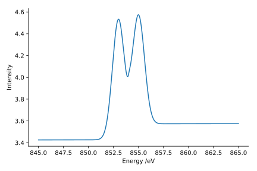

.. _Fitting:

Fitting X-ray Absorbance Spectra
================================

When numerical methods are insufficient, it may be necessary to fit
the pixel spectra with a model function and extract parameters from
the model. The core :py:class:`~xanespy.xanes_frameset.XanesFrameset`
class has methods for common fitting-related use-cases, such as using
curves to approximate L\ :sub:`3` and K edges, and linear
combination fitting of standard spectra. If the pre-rolled options are
not enough, arbitary callables can be created and fit against the
data. The following is an example for fitting a single L-edge
spectrum:

.. code:: python

   Es = np.linspace(845, 865, num=1000)
   obs = ... # Load your data
   l3 = xp.fitting.L3Curve(Es, num_peaks=2)

   # Create initial guess, matching ``l3.param_names``
   p0 = (1.1, 853, 0.6, 1, 855, 0.6, 0.15, 854, 10, 3)

   # Now do the fitting
   result = xp.fitting.fit_spectra(observations=obs, func=l3, p0=p0)
   params, residuals = result

   # Plot the resulting fit and original data
   predicted = l3(*params)
   plt.plot(Es, obs)
   plt.plot(Es, predicted, linestyle=':')

.. todo:: Come up with a better illustration for fitting.

Linear Combination Fitting
--------------------------

Often times the observed spectrum is a linear combination of spectral
sources from known standards. This works best when the standards is
stable and have been isolated and measured on the same instrument as
the observed data.

In order the fit linear combinations of source, use the
:py:meth:`~xanespy.xanes_frameset.XanesFrameset.fit_linear_combinations`
method:

.. code:: python

    # Load your previously imported data
    fs = xp.XanesFrameset(...)

    # Prepare the sources for fitting
    source1 = ...
    source2 = ...

    # The sources must have the same number of points as the data
    assert len(source1) == fs.num_energies
    assert len(source2) == fs.num_energies

    # Now execute the fitting
    results = fs.fit_linear_combinations(sources=[source1, source2])
    fits, residuals = results
    
.. todo:: Create a figure to illustrate LC fitting.

This method will create three new HDF5 datasets:

* linear_combination_parameters (maps)
* linear_combination_residuals (maps)
* linear_combination_sources (arrays)

The naming prefix can be controlled by passing the ``name`` parameter
to
:py:func:`~xanespy.xanes_frameset.XanesFrameset.fit_linear_combinations`
method. If more control is needed, the
:py:class:`xanespy.fitting.LinearCombination` class can be subclassed
and given to the
:py:meth:`~xanespy.xanes_frameset.XanesFrameset.fit_spectra` method as
described :ref:`below<roll-your-own>`.

Fitting K- and L- Spectral Edges
--------------------------------

A common use case is to fit the spectra with either a K-edge or L-edge
shape. This can be done easily with the
:py:meth:`~xanespy.xanes_frameset.fit_l_edge` or
:py:meth:`~xanespy.xanes_frameset.fit_k_edge` methods.

.. _roll-your-own:

Rolling Your Own Fit Function
-----------------------------

If none of the options suit your needs, you can create a callable that
produces the curve you wish to fit given a number of parameters, then
pass this to the
:py:meth:`~xanespy.xanes_frameset.XanesFrameset.fit_spectra`
method. In the simplest case this can be a simple function:

.. code:: python
    
    import numpy as np
    import xanespy as xp
    
    # Define the function we wish to fit against
    def sin_curve(scale, frequency, phase):
        theta = np.linspace(0, 2*np.pi, num=100)
	out = scale * np.sin(frequency * theta(phase))
	return out
    
    fs = xp.XanesFrameset(...)
    # Come up with an initial guess
    pnames = ('scale', 'frequency', 'phase')
    p0 = (0, 1, 0)
    fs.fit_spectra(func=sin_curve, p0=p0, pnames=pnames, name='sin_curve')

In many cases, static information (such as the list of energies) is
needed to construct the curve. This can be given to a class's
constructor and the algorithm itself placed in the ``__call__``
method. This is illustrated below by fitting a variable number of sine
waves, making a sort of horribly inefficient fourier transform. Since
the number of sine waves is not known at import-time, the use of
star-arguments makes the result more dynamic. Adding the
``param_names`` saves us the trouble of passing it in every time.

.. code:: python

    # Define a new callable for passing to the fitting function
    class SineCurves():
        def __init__(self, theta, num_sines=1):
	    self.theta = theta
	    self.num_sines = num_sinces
	
	def __call__(self, *params):
	    out = np.zeros_like(self.theta)
	    # Iterate on the parameters in groups of 3
	    for i in xrange(0, len(params), 3):
                scale, freq, phase = params[i:i+3]
		# Add another sin wave to the total curve
		out += scale * np.sin((self.theta-phase) * frequency)
	    return out
        
	@property
	def param_names(self):
	    # Build a list of 2 params for each sine wave
	    names = []
	    for num in range(self.num_sines):
	        names.append('scale%d' % num)
		names.append('frequency%d' % num)
		names.append('phase%d' % num)
	    return names

    # Create the actual callable object
    theta = np.linspace(0, 2*pi, num=100)
    sines = SineCurves(theta=theta, num_curves=3)
    # Load the data
    fs = xp.XanesFrameset(...)
    p0 = []
    for i in range(3):
        p0.append(1, 2*i+1, 0)
    fs.fit_spectra(func=sines, p0=p0, name='sine_curve_fit')
