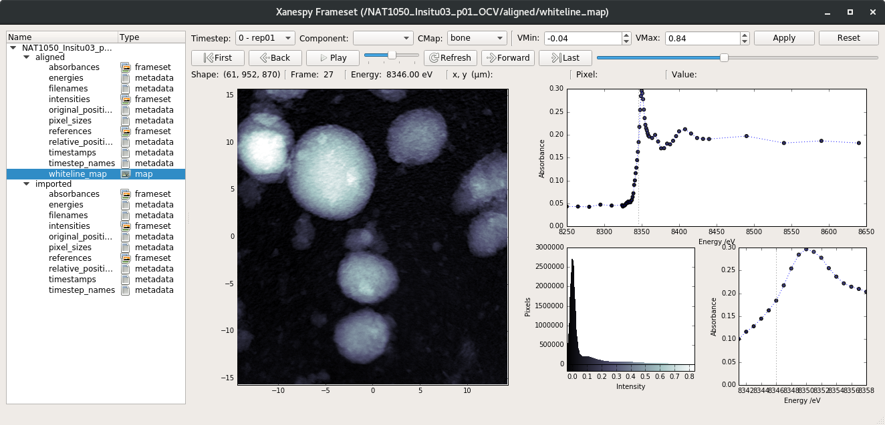
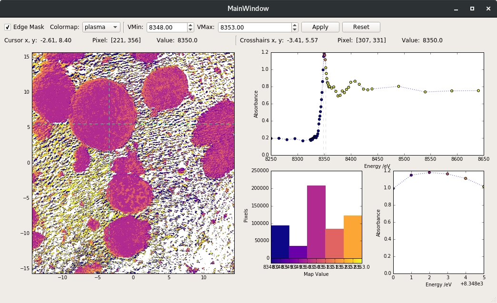

Visualization of Results
========================

Plotting
--------

The ``XanesFrameset`` object has a number of methods for plotting.

Interactive (Qt) Viewer
-----------------------

Xanespy includes a graphical user interface that allows for
interactive visualization of X-ray frames and maps. To launch the
viewer, prepare a ``XanesFrameset`` object and run the ``qt_viewer()``
method::

    fs = XanesFrameset(...)
    fs.qt_viewer()

The data tree on the left of the window shows the possible datasets
than be viewed. Choosing an entry with type "frameset" will load and
plot the frames, spectra and histograms in the frame window. If a
"map" entry is selected, the map window will be launchedx and the
frames that went into making the map will be shown in the frame
window.

In the interest of encouraging reproducibility, the **ability to
export plots has been intentionally left out**. Any options selected
in the GUI can be passed into the ``plot_map``, ``plot_histogram`` or
``plot_spectrum`` methods of the frameset object. The name of the
entry in the data tree is given as the keyword argument
``representation``.

.. warning:: The interactive viewer has no effect on the underlying
             frameset or accompanying data, with one exception:
             changing to a different top-level branch in the data tree
             will change the ``XanesFrameset.data_name``
             attribute. Before proceeding with analysis, either revert
             the ``data_name`` attribute manually or create a new
             ``XanesFrameset`` object.

   Screenshots of the Qt viewer. Frame window (top) and map window
   (bottom).
